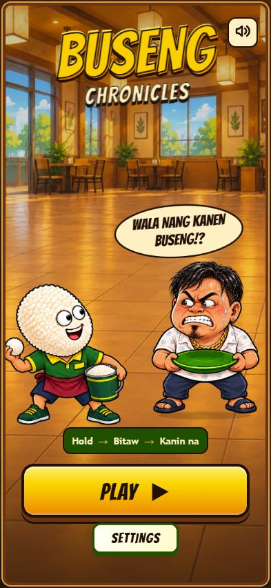
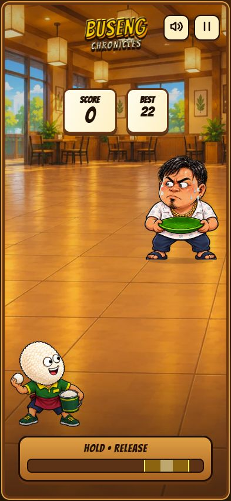
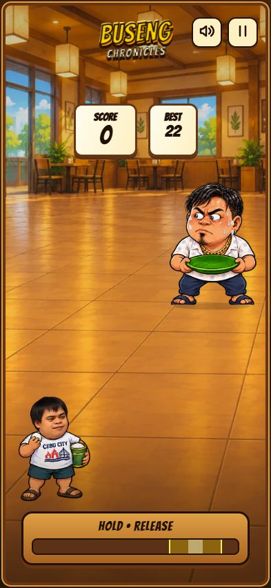

# Buseng Chronicles

**Wala nang kanen, Buseng!?** A funny, one-button Filipino meme-inspired rice-throwing game for Android and PC. Developed by **NPC**.

[](https://github.com/npcagomoc-del/buseng-chronicles/releases/download/v1.0.0/Buseng-Chronicles-v1.0.0.apk)
[](https://github.com/npcagomoc-del/buseng-chronicles/releases/tag/v1.0.0)

The counter uses GitHub release-asset downloads, including repeat and verification downloads. It is **not unique players, installs or button clicks**. The badge is cached; the exact count is the APK asset's `download_count` in the [public release API](https://api.github.com/repos/npcagomoc-del/buseng-chronicles/releases/tags/v1.0.0). No in-game analytics service is added.

## Screenshots

<p>
  
  
  
  
</p>

These are actual game screenshots from the reviewed version, not promotional mockups.

## How to play

1. Press **PLAY**. On a phone, hold the screen or HOLD • RELEASE control; on PC, hold the mouse or **Space**.
2. Watch the arc and charge bar. Release when the rice will land on Buseng's **actual green plate**.
3. Each serving earns one point. Center catches are **perfect**. The charge bar reverses after maximum, so you can wait for another timing window.
4. Three consecutive perfect catches start the cheek-slap gag. The next release is flaming chicken-oil rice with arcade fire music and a spicy reaction. Keep hitting perfects to continue; an ordinary catch or miss breaks the streak.
5. Buseng gets faster as the score grows, with level changes every 20 points and teleports starting at 10. He holds his plate position while rice is airborne for fair aiming.
6. One miss ends the run. Press **ISA PA!** to retry. Use pause or **Escape**, then **Continue Playing**.

**Settings:** choose Rice Man or Tahp, adjust Music/Sound FX independently, enable full/reduced animations, or reset the locally saved best score with confirmation.

## Download and install on Android

1. Open the [Version 1 release](https://github.com/npcagomoc-del/buseng-chronicles/releases/tag/v1.0.0).
2. Download **Buseng-Chronicles-v1.0.0.apk** under Assets, not the source ZIP.
3. Open it on your phone. If Android asks, allow installation from the browser/file manager you used; you can turn that permission off afterward.
4. Install and launch **Buseng Chronicles**. The installed game works offline and does not need a PC server.

Verify the optional accompanying SHA-256 file. Windows: `Get-FileHash .\Buseng-Chronicles-v1.0.0.apk -Algorithm SHA256`.

**Version 1 is the reviewed v0.1.9 APK renamed without rebuilding.** Android Settings may display **0.1.9**, versionCode 9. Its SHA-256 remains `e5d5b27178a23871f2a5c764fefd1a61659c83ea85635242fa1ad5444c7e2772`. It is debug-signed, not a Play Store production build. Installing over the previous NPC preview preserves local data because the package/signing identity is unchanged.

See [releases and package details](docs/RELEASES.md) for the APK size, application ID, SDK versions, permissions and download-count explanation.

The manifest declares Android 7.0/API 24+. The final build was exercised on an API 36 emulator. Physical-phone smoothness/audio, older Android versions, and an earned native three-perfect streak need community playtesting. Keep Android System WebView updated.

## Run on PC

Install **Node.js 24+**, **pnpm**, **Git**, and **Bun** for tests, then:

```sh
git clone https://github.com/npcagomoc-del/buseng-chronicles.git
cd buseng-chronicles
pnpm install --frozen-lockfile
pnpm dev
```

Open the URL printed by Vite. For a production preview:

```sh
pnpm check
pnpm test
pnpm build
pnpm preview --host 127.0.0.1 --port 4174 --strictPort
```

On Windows, after `pnpm build`, `Start-Game.cmd` opens the game. The PC version runs in the browser. See [setup and APK building](docs/SETUP.md), [contributing](CONTRIBUTING.md), and the [copy-paste prompt for your AI tool](docs/AI-CONTRIBUTOR-PROMPT.md).

## Inspiration and purpose

**Hindi ko ginawa ang larong ito para pagkakitaan ang mga characters.** This is a free fan project for fun, learning and community improvement: no ads, purchases or paid character unlocks.

We are inspired by famous Filipino memes, especially the recent viral **Buseng “walang kanen” video**, the Tahp meme, and **Mang Inasal's** restaurant atmosphere, green/yellow palette and unli-rice culture. Arcade fire feedback takes inspiration from NBA Jam; teleport timing and plate-slam energy draw from familiar game/anime references. These are inspirations, not affiliations or endorsements. Restaurant logos and reference GIF frames are not bundled.

The source code is [MIT licensed](LICENSE), so you can copy, fork and improve it. The code license **does not grant rights to third-party meme voices, likenesses, sound clips or the bundled font**. See [ASSETS.md](ASSETS.md) for attribution and asset-specific limits. Noncommercial intent does not establish permission from original creators. Respect their rights when redistributing/replacing assets; do not imply endorsement.

## Privacy and security

Scores/settings stay locally in the browser/app. No login, backend database, API key, in-game download tracker or advertising SDK is required. The APK has Internet permission for its WebView, but game assets are bundled. GitHub/Shields provide release-download statistics separately from gameplay.

Local tools, internal QA reports, raw source videos, environment files, SDK paths and signing keystores are excluded. See [SECURITY.md](SECURITY.md). Public files and APK are scanned before publication; future contributors must keep secrets out of commits.
